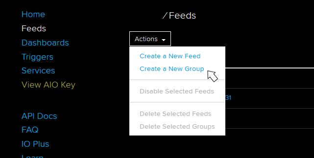

# mm1 Technology NB-Iot Relay Service - Cloud Connector

The application establishes a simple MQTT connection 
to the Adafruit-MQTT broker and to the Azure Central-IoT-MQTT broker for receiving NB-IoT messages, 
provided via mm1 Technology NB-IoT Relay Service. 
The connector can be used with mm1 Technology NB-IoT Demo Kit.


## Prerequisites

- node.js v10.13.0
- mm1 Technology Relay Service account
- Addafruit.io account and/or
- Microsoft Azure IoT account 

## Table of Contents
[1 Generate the App Token via NB-IoT Relay Service API](#anchor1)  
[2 Setup an Adafruit.io Account and Find Out Your Credentials](#anchor2)
[4 Send and receive Data via Adafruit.io](#anchor3)  
[3 Setup Azure IoT Central application and generate the Connection String](#anchor4)  
[5 Send and receive Data via Azure IoT Central](#anchor5)  
[6 Run the Application](#anchor6)
[7 Authors](#anchor7)  
[8 License](#anchor8)  
[9 Acknowledgments](#anchor9)  

### Install node.js

- Install node.js v10.13.0 from https://nodejs.org/en/download/ 
- Before you first time run the application navigate with the command line to the 
project folder of the Cloud Connector and execute:  

```
npm install
```

to install the necessary node modules and dependencies.
 
## Configure your mm1T Relay Service - Cloud Connector
- To configure the application rename the file *config_template.json* from the folder */config* into *config.json*. 
The *config.json* stores your credentials for connections to mm1 Technology NB-IoT Relay Service and to the 
cloud services. To find out, how to get the data for the config.json and how to register your devices for the Relay Service 
refer to the following topics:
    - [Generate the app token via the mm1 Technology NB-IoT Relay Service API and register your NB-IoT Devices](#anchor1)
    - [Setup an Adafruit.io account and find out your credentials](#anchor2)      
    - [Create an Azure IoT Central application and generate the Connection String](#anchor4)
- For the cloud settings, which are necessary to show the sensor data of your device (here specifically *mm1T NB-IoT Demo Kit*) in a cloud 
and to control the device settings from the cloud refer to:
    - [Show the sensor data, show message on the LED-Display and set the sending interval of the mm1 Technology NB-IoT Demo Kit with Adafruit.io](#anchor3)
    - [Show the sensor data, show message on the LED-Display and set the sending interval of the mm1 Technology NB-IoT Demo Kit with Azure IoT Central](#anchor5)
<a name="anchor1"></a>
### 1. Generate the App Token via the mm1 Technology NB-IoT Relay Service API ###
#### 1.1 Generate the App Token 

   - The app token can be easy generated using the *Swagger UI* on NBIoT Relay Service
   - Scroll down to the *Login* group and click on the *POST* button of the */api/login* path. 
   - Use the button *Try it out* to get the possibility to enter your data.
   - Enter your user name and password for the mm1 Technology Nb-IoT Relay Service and perform the request 
by pressing *Execute* 
   - You will get the *Server response* with a *token* in the *Response body* :    
  
  
  
  - Select and copy the token without the double quotes.
  - Now you can close the tab.
  - Scroll up and click on the *Authorize* button in the upper right corner of the website:       
    
  - Type 
  ```
  Bearer <paste here your token>
  ```
 into the Field: *Value:*
 
   - Confirm with *Authorize*.
   - After the Authorisation request is confirmed by the website exit with *Done*:    
      
    
   - Now you are authorized to perform https requests to the API of the Relay Service via the Swagger UI
   - To generate the app token scroll to the group *User* and click on the *POST* button of the */api/user/tokens* path, 
   and perform the request by using the Buttons *Try it out* and Execute.
   - You will get the *Server response* with your *app token* in the *Response body* :
   ```
   {
     "app_token": "<your app token>",
     "result": "success"
   }
   ```
   
#### 1.2 Perform configurations necessary to connect to the NB-IoT Relay Service
   - Copy the app token and paste it into the *config.json* file in the 
   folder *config* of the Cloud Connector Software like shown below. Set also the *<url of the NB-IoT Relay Service>* , without *https://* at the beginning and optionally 
   the string value: *"filterImsi"*. If you have registered more than one device on the NB-IoT Relay Service all messages from all devices 
   are going to be logged to the console and relayed to cloud. If you set a value of the *"filterImsi"* to be the imsi of one of your registered NB-IoT devices 
   only messages from that device will be relayed to the cloud. If you want to use the *Azure IoT Central Connector*  it is necessary set the *"filterImsi"* 
   because in the current version the *Azure IoT Central Connector* is designed to connect to only one device homepage in the cloud. 
   With the current version of the *Adafruit.io Connector* it is possible to observe telemetric data and to control more than one NB-IoT device, and therefore you generally need not to set *"filterImsi"*. 
   If you don't want to set the *"filterImsi"*, set the default Value: *""*
   - **NOTE:** If you have an *Adafruit.io free account* and if you want to communicate with mm1T NB-IoT Demo Kit, which uses 8 feeds, it is strongly recommended to set the value of *"filterImsi"* to be the imsi of your mm1T
   NB-IoT Demo Kit, because the maximal number of 10 feeds will possibly be exceeded: 
   ```
   ...
   
   "udpRelayService": {
        "url": "<add the url of the NB-IoT Relay Service>",
        "bearerToken": "<add the app token generated via mm1 technology NB-IoT Relay Service API>",
        "filterImsi":"<imsi of your mm1T NB-IoT Demo Kit>"       
      },
   
   ...
   ```
   
  - The Cloud Connector Software is now ready to communicate with your devices via *mm1T NB-IoT Relay Service*, but it still need to be configured for the communication with a cloud
  
#### 1.3 Register a new Device in the Backend of the mm1T NB-IoT Relay Service:
  - Perform the authorization like shown above
  - Perform the https *POST* method on the URL */api/device*  in the group *Device* with the *Request body* :
  ```
  {
    "imsi": "<the IMSI of the SIM Card in your NB-IoT Device>",
    "name": "<an arbitrary device name>",
    "user": "<your user name for the mm1T NB-IoT Relay Service>",
    "valid_from": "<YYYY-MM-DD HH:MM:SS>",
    "valid_until": "<YYYY-MM-DD HH:MM:SS>"
  }
  ```
  - To get the overview of your registered NB-IoT Devices perform the https *GET* request on the URL 
  */api/devices* in the group *Devices*
  
<a name="anchor2"></a>
### 2. Setup an Adafruit.io Account and Find Out Your Credentials 
  - If you attend to use this software to connect to *Adafruit.io*, it is necessary to create an account on  https://io.adafruit.com  
  - Login to your account and navigate to the tab *Dashboards*
  - Create a new Dashboard by clicking on the option *Create a New Dashboard* in the drop down menu *Actions*:
   
   
  - Open your dashboard by cliking on the dashboard name
  - You can find your credentials for *Adafruit.io* by clicking on the *'key'* icon in the rigth upper corner
  of the dashboard:
  
   
  - Copy the *Active Key* from the pop-up window and paste it into the *config.json* file in the folder *config* 
  of the Cloud Connector Software
  ```
   "adafruit": {
          "adafruitOptions": {
              "login": "<add your Adafruit User Name>",
              "pwd": "<add your Adafruit Active Key>",
              "server": "mqtts://io.adafruit.com",
              "port": 8883,
              "conName": "Adafruit.io"
          },
         "subscribeToTopics":["<add your Adafruit User Name>/feeds/imsi-<add the device IMSI>.set-oled",
                  "<add your Adafruit User Name>/feeds/imsi-<add the device IMSI>.set-interval"]
      },

  ```
  - Also fill in your Adafruit User Name into *"adafruitOptions"* and into feed names in the array *"subscribeToTopics"*
  - If you do not attend to control your device from the *Adafruit.io*, it is not necessary to subscribe
  to any topics. In this case let *"subscribeToTopics"* be an empty array:
  ```
    "subscribeToTopics":[]
  ```  
  - The topic names in the *Cloud Connector Software* must also contain the IMSI of your NB-IoT Device with the prefix *imsi-*,
  like shown in example:  
  ```
  myusername/feeds/imsi-123456789123456.mytopicname"
  ```
  - If you use the *mm1 Technology NB-IoT Demo Kit* you need to subscribe to the topics *set-oled* and *set-interval* like in example:
  ```
    "subscribeToTopics":["mmmyusername/feeds/imsi-123456789123456.set-oled", "myusername/feeds/imsi-123456789123456.set-interval"]
  ```
  - **NOTE:** The feed names for *Adafruit.io* are only allowed to contain lowercase letters and "-". The point in the feed name separates the
  group name (the topics can be grouped for better overview) from the topic name. To configure your feeds on Adafruit.io portal read [Show the sensor data, show message on the LED-Display and set the sending interval of the *mm1 Technology NB-IoT Demo Kit* with Adafruit.io](#anchor3)
  - After you have saved the *Adafruit.io* related data to the *config.json* file the Cloud Connector Software can connect to *Adafruit.io MQTT broker*. (See [Run the Application](#anchor6))

<a name="anchor3"></a>
### 3. Show the Sensor Data, Show Message on the LED-Display and Set the Sending Interval of the mm1 Technology NB-IoT Demo Kit with Adafruit.io
  - Login to your *Adafruit.io* account and open the tab *Feeds*
  - Click on *Create a New Group" in the drop down menu *Actions*:

  
    
  - Enter the group name: 
  
  ```
  imsi-<the IMSI of the SIM card in your NB-IoT Demo Kit>
  ```
  and confirm with the button *Create*
  - After the group is created, use the *Actions* drop down menu again to *Create a New Feed*. Take care to select the correct group name 
and to confirm with the button *Create*. Create Feeds *set-oled* and *set-interval* 

     
  - Now you can start the Cloud Connector Software like described in [Run the Application](#anchor6) <br><br>
  - To get sensor data it is fortunately not necessary to create feeds on *Adafruit.io*. *Adafruit.io* creates the feeds automatically from the feed names of the incoming messages.
  The image shows all feeds published by the mm1T NB-IoT Demo Kit inclusive the two feeds, we subscribed to in the previous step:
  
     
  - To let the NB-IoT Demo Kit show a message on the LED Display click on the feed *set-oled* in the feed list. A new window appears, where usually a numerical data are plotted. 
  Click on the button *+ Add Data* under the plot area and type your message into the pop-up window *Add Data*:
  
  
   
   - **NOTE:** In the current Version of the mm1T NB-IoT Demo Kit the displayed message can occupy one line on the LED display i.e. the length of the message must not 
   exceed 15 characters, white spaces inclusive .
   - After you have confirmed by clicking on the button *Create*, the message will be sent to the NB-IoT Relay Service. Not before the device (NB-IoT Demo Kit) sends a new data to the NB-IoT Relay Service, 
   the message will be sent to device and will appear on the LED display.
   - In the same way you can set the sending interval by clicking on the feed *set-interval* in the feed list and entering the time interval in seconds e.g. *25*
   The new setting will be effective not before the device sends new data to the NB-IoT Relay Service.
   - The default value of the sending interval is 30 seconds. It is strongly recommended to consider the **lower limit for sending interval of 15 seconds** especially if you 
   use a free adafruit.io account with the data rate limited to 30 points per minute.
   
#### 3.1 Using the Adafruit.io Dashboard to Control Devices and to Show Location and Telemetric Data  

  - Navigate to the tab *Dashboards* and open your Dashboard.
  Click on the *+* symbol in the upper right corner of the dashboard to add a new tool:
   
     
 
  - The menu *Create a new block* appears. The names of the blocks appear on mouseover. The Blocks named *Toggle*, *Momentary Button*, 
  or *Slider* can be used to control a remote device. The Blocks like *Linechart* and *Map* can be configured to show telemetry data and the current location.
  - To control the sending interval by a dashboard tool *Slider* , choose the block *Slider* in the *Create a new block* menu. 
  - Now the pop-up window *Choose feed* appears, where you can assign a feed (mqtt topic) to the dashboard tool. Select the feed *set-interval* and continue with *Next Step*.
  - The pop-up window *Block Settings* appears. Fill the fields like shown in the image
  Set the *Published Value* to 30 (default value) bei dragging the slider in the *Block Preview* :
      
  
  
 - To show the location data in a map, create a map from the block *Map* and assign the topic *location* to it (in the same way as shown on the *Slider* example).
 - To show the telemetry data in a plot create a plot from the block "Line Chart"  or from a block *Gauge* and assign one of the telemetry related topics to it.
 - An example of a Adafruit.io dashboard is shown in the image:
 
  
  
  
<a name="anchor4"></a>
### 4. Create an Azure IoT Central application and generate the Connection String

  - In the current version of the Cloud Connector the software communicates with a device instance, configured in an Azure IoT Central Application.
  For secure communication a Connection String, containing a Shared Access Key will be generated.
  - To create the Azure Iot Central Application navigate to http://www.azureiotcentral.com/ and login with your Microsoft Account. If you still don't have a
  Microsoft Account you can create it by following the instructions on https://signup.live.com.
  - After login, the welcome website of Azure IoT Central appears. Click the button *Get started* to get to the dashboard *My applications*. 
  - With the click on the button *New Application* the *Create Application* window appears. Enter the name of your new application, activate the radio button
  *Custom Application* and confirm with the *Create* button. 
  
    
  - The *Homepage* of your application appears. Click on the Button *Create Device Templates* , and enter the name of your new device template. 
  You will be navigated to the homepage of the device template. If you attend to communicate with more then one device with the same functionality (telemetrics, settings, etc), 
  then it is advisable to click on *Edit Template* and to configure all necessary device attributes from the listed attributes in the task menu.   
  To do this, refer to [Show the sensor data, show message on the LED-Display and set the sending interval of the mm1 Technology NB-IoT Demo Kit with Azure IoT Central](#anchor5). 
  In contrary, you can perform the configuration also on the active device instead on the template.
  - After the template is created (full configured or not), the one or more active devices can be created from the template. 
  To do this open the tab *Device Explorer* on the left sidebar, select your template in the side bar *Templates*, open the "+" - drop-down menu, and select *Real*, like shown in the image: 
  
  
  - The *Create New Device* window pops up, where you can change the suggested *Device Name*. Confirm with *Create*.
  - You will be navigated to the homepage of your active device. All configurations, which you have performed on your template, are inherited by the created active device. 
  - Click on *Connect* in the upper right corner of the device homepage.
  
   
  - The pop-up window *Device Connection* will be shown, containing all necessary connection data.
  
    
  - The connection data *Primary Key*, *Device-ID*, and *Scope ID* are needed to create a symmetric key by the [Azure IoT DPS Symmetric Key Generator](https://www.npmjs.com/package/dps-keygen) software. 
  - To install the *Azure IoT DPS Symmetric Key Generator* navigate with the command line to the project folder of the *Cloud Connector* and execute:
    
  ```  
  npm i -g dps-keygen@0.2.1
  ```
  - Now the software can be used. Perform the command: 
  ```
  dps-keygen <Primary Key> <Device-ID> <Scope ID>
  ```
  The code below shows the example implementation of the command and the generated output:
  
  ```
  C:\Users\username\rs_clud_connector>dps-keygen I/GvlAyaSKl1CarpR/OwYWGCMRUMPUEOXARQ+E2diy8= 4c05f4c4-165f-4b48-8790-6005f23b9c91 0ne00046962
  
  Azure IoT DPS Symetric Key Generator v0.2.1
  MASTER-KEY: I/GvlAyaSKl1CarpR/OwYWGCMRUMPUEOXARQ+E2diy8=
  BASE-DEVICE-ID: 4c05f4c4-165f-4b48-8790-6005f23b9c91
  Connection String:
  
   HostName=iotc-6c1716cd-0120-446f-b66b-220693ee6948.azure-devices.net;DeviceId=4c05f4c4-165f-4b48-8790-6005f23b9c91;SharedAccessKey=I/GvlAyaSKl1CarpR/OwYWGCMRUMPUEOXARQ+E2diy8=
 ``` 
 - To enable the connection of the *Cloud Connector* software, copy the generated *Connection String* and paste it into the *config.json* file in the folder *config* like in the code example below
 ```
 ...
 
     "azure": {
         "connectionString": "HostName=iotc-6c1716cd-0120-446f-b66b-220693ee6948.azure-devices.net;DeviceId=4c05f4c4-165f-4b48-8790-6005f23b9c91;SharedAccessKey=I/GvlAyaSKl1CarpR/OwYWGCMRUMPUEOXARQ+E2diy8=",
         "deviceProperties": {
            "devName": "mm1 Technology NB-IoT Demo Kit", // or some other
            "imsi": "123456789123456"
         }
    }    
 ...
    
 ```
 - If you attempt to control your NB-IoT device from your *Azure IoT Central* application, also take care to enter the correct IMSI of your NB-IoT device, as shown above. 
 - To configure the active device homepage (or the template device homepage) to receive sensor data and to control you NB-IoT device refer to
 [Show the sensor data, show message on the LED-Display and set the sending interval of the mm1 Technology NB-IoT Demo Kit with Azure IoT Central](#anchor5) 
 - After you have saved the *Azure* related data into the *config.json* file the *Cloud Connector* software is ready to connect to the *Azure IoT Central MQTT broker* 
 i.e. to your active device homepage. (See [Run the Application](#anchor6))

<a name="anchor5"></a>  
### 5. Show the sensor data, show message on the LED-Display and set the sending interval of the mm1 Technology NB-IoT Demo Kit with Azure IoT Central 

  - An *active device homepage* or an *device template homepage* in an *Azure IoT central* application need to be configured for both - receiving sensor data and for sending messages to your real device.
  - It is possible to configure different attributes of the device homepage:
        - Measurements - to receive sensor data, status messages or events (e.g. alarm signal)
        - Settings - to send Messages to the device
        - Properties - to receive device properties from the real device
        - Commands - to send commands to the device
        - Dashboard - to present the sensor results predefined in *Measurements*, Device settings predefined in *Settings* etc.
  - To configure an attribute select it in the menu bar of the device homepage and click on *Edit Template*:
  
    
   
#### 5.1 Configure the Measurements attribute to receive the sensor data form the mm1T NB-IoT Demo Kit
 -   Click on the tab *Measurements* in the menu bar of the device homepage, click on the *Edit Template*, than on *+ New Measurement*  an on the radio button *Telemetry*
 - The window *Create Telemetry* appears:
 
 
 
 - Fill the form like shown in the image above and save. **NOTE:** the *Field Name* must be the same like the corresponding variable name in the software of the *mm1T NB-IoT Demo Kit*
 - To see all sensor data sent by the *mm1T NB-IoT Demo Kit* it is necessary to configure the measurements with the *Field Names*: 
      - temp
      - humidity
      - distance
      - lightlum
      - lightlux       
 - After you have configured all measurements confirm with the *Done* button.
 
#### 5.2 Configure Properties to receive the device Properties form the mm1T NB-IoT Demo Kit 
 -  The location is treated by Azure IoT Central like a *device property*.  To configure the properties which are
 going to be reported by the device, click on the tab *Properties* in the menu bar of the device homepage, and then on the *Edit Template* button
 - Select the library *Device Property* from the side bar *Library* and configure the property of the *Data Type* location with the *Field Name*: *location*:
 
  
 - In the similar way configure:
    - *Device Property* with the *Field Name:*  *imsi* of the *Data Type:* *text* to get the IMSI of the NB-IoT device reported by the Cloud Connector
    - *Device Property:* with the *Field Name:*  *devName* of the *Data Type:* *text* to get the Device Name of the NB-IoT device reported by the Cloud Connector
    
#### 5.3 Configure Settings to Show a Message on the LED Display and to Set Device Interval of the the mm1T NB-IoT Demo Kit
   - To configure Settings go to the tab *Settings* in the menu bar of the device homepage, and then click on the *Edit Template* button
   - Select the library *Text* from the side bar *Library* and configure the Setting with the *Field Name:* *oled* like shown in the image and confirm with *Save*
   
    

   - Select again the library *Text* from the side bar *Library* and configure the Setting with the *Field Name:* *interval* in the same way, but set the *Initial Value* to 30
 Confirm with *Save*
   - Exit the Settings Template with the *Done* button. 
   - Now you can start the Cloud Connector Software like described in [Run the Application](#anchor6) 
   - You will see the telemetry data in the *Measurements* tab and the Device Properties ind the tab *Properties* tab.
   - In the *Settings* tab you can type the message desired to be shown on the LED Display of the NB-IoT Demo Kit and to set the sending interval. 
   It is necessary to click on the button *Update* to send the setting to the device.
 
   - **NOTE:** In the current Version of the mm1T NB-IoT Demo Kit the displayed message can occupy one line on the LED display i.e. the length of the message must not 
    exceed 15 characters, white spaces inclusive .
   - After you have confirmed by clicking on the button *Update*, the message will be sent to the NB-IoT Relay Service. Not before the device (NB-IoT Demo Kit) sends a new data to the NB-IoT Relay Service, 
    the message will be sent to device and will appear on the LED display.
   - In the same way you can set the sending interval by entering the time interval in seconds e.g. *25*
    The new setting will be effective not before the device sends new data to the NB-IoT Relay Service.
   - The default value of the sending interval is 30 seconds. 
 
#### 5.4 Configure and Send Commands to the Cloud Connector
   -  In order to show how to use a command, which can be configured in the tab *Commands* the *Cloud Connector Software* supports the Command configured with the *Field Name* *command*. 
 If you configure a command with this field name, you will see the incoming command in the log of the *Cloud Connector Software*. Currently commands are not relayed to devices via the NB-IoT Relay Service.
   -  To configure a command go to the tab *Commands* and click on the *Edit Template* button and then on *+ New Command*
   -  Enter the *Display Name* and the *Field Name* like shown in the image. Click on + right from *Input Fields* and the new section *New Command Param* appears. 
 
   
   -  Click on it to open the section. Create also the second one by clicking on + and and open it by clicking on *New Command Param*. Fill the fields like shown in the image:
 
    
   -  You have just created a set of two commands, one of the type *text* and the another of the type *toggle* which both correspond to the *Field Name: command*
 on the *Cloud Connector Software*
 
   -  Confirm with *Save*. 
   -  Enlarge the created window, so that the both created commands and the *Run* button can be seen. Exit the *Commands* tab by clicking on *Done*.
   -  To execute the command drag the toggle switch into the desired position and eventually typ a new text in the field of the Text Command:
 
    
   - Click on the *Run* button:
     
   - The command request appears in the log of the *Cloud Connector Software*:
 ```
 Command received:  { text: 'Message from Azure IoT Central', toggle: true }
 ```
   - In the tab "Rules" in the menu bar of the device homepage it is possible to set rules based on measured data and to configure actions (e.g. E-Mail notifications) triggered by that rules.
 To learn more about configuring rules and actions refer to https://docs.microsoft.com/de-de/azure/iot-central/howto-create-telemetry-rules.
 
#### 5.5 Create a Dashboard to Present the Measured Data and the Device Properties
   - To create a Dashboard containing measured data, go to the tab *Dashboard* and click on *Edit Template*. 
   - Select the desired form of data presentation from the side menu *Library*. 
   - Depending on the selected library, in the next step, you will be able to select one or more telemetry measurements or some device properties to be shown on the dashboard.
   - The image below shows a dashboard created by using the following libraries:
      - *Label* (to show the title), 
      - *Settings and Properties* (to show the Device Name, IMSI...), 
      - *KPI* (to get the average temperature and humidity of the last 30 minutes), 
      - *Last Known Value* (to show the current distance),
      -  and the libraries *Map*, *Line Chart* and *Bar Chart* :
    
  
 
 <a name="anchor6"></a>
## 6.Run the Application
### 6.1 Run the Adafruit Connector: 
 - Make sure that you have performed all steps to configure communication with the mm1T NB-IoT Relay Server and with the *Adafruit.io* Platform. 
 - Delete all comment lines in the config.json an save the file.
 - Navigate with the command line to the project folder of the Cloud Connector and type: 
 ```
 npm run adafruit
 ```
###  6.2 Run the Microsoft Azure IoT Central Connector: 
  - Make sure that you have performed all steps to configure communication with the mm1T NB-IoT Relay Server and with the *Adafruit.io* Platform. 
  - Delete all comment lines in the config.json an save the file.
  - Navigate with the command line to the project folder of the Cloud Connector and type: 
  ```
  npm run azure
  ```

<a name="anchor7"></a>
## 7.Authors

* Andjela Vuckovic dos Reis and Lyn Matten
- Company: http://mm1-technology.de/
- GitHub:  https://github.com/mm1technology/

<a name="anchor8"></a>
## 8.License

This project is licensed under the MIT License - see the [LICENSE.md](LICENSE.md) file for details

<a name="anchor9"></a>
## 9.Acknowledgments
 Used tutorial: 
https://docs.microsoft.com/en-us/azure/iot-central/howto-connect-nodejs-experimental


